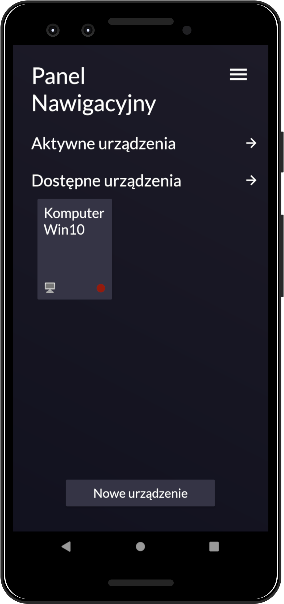

# 🥱 WakeOnLAN
Wake On LAN application for android devices. Turn on your devices in network and get informations about thier status.

Dashboard                  |  Dashboard 2              |  Device panle             |  Running the device       |     
:-------------------------:|:-------------------------:|:-------------------------:|:-------------------------:|
          |          |          |          |

## 🔍 Table of contents
* [General info](#-general-info)
* [Technologies](#-technologies)
* [Features](#-features)

## 📝 General info
The application is used to run devices through WOL technologies and get informations about thier status, it will be useful to anyone who likes to start a computer from the bed level.
	
## 🛠 Technologies
Project is created with **Java**.

📚 Libraries:
* [ROOM](https://developer.android.com/jetpack/androidx/releases/room)
* [Lifecycle](https://developer.android.com/jetpack/androidx/releases/lifecycle)
* [android-gif-drawable](https://github.com/koral--/android-gif-drawable)

## 💡 Features
* Save your device manualy and by network scanner
* Device status preview
* Starting devices in the local network
* Support SecureOn

#### 🎯 TO DO:
* Scheduled launch

## ☄ Download

